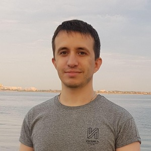

# Vova **Kusakin**

## Full stack Developer | ReactJs 4+ | Web 10+

CV: [<u>en</u>](https://kusakinvova.github.io/md/) [<u>ru</u>](https://kusakinvova.github.io/md/ru) [<u>ua</u>](https://kusakinvova.github.io/md/ua)

CV full: **en** [<u>ru</u>](https://kusakinvova.github.io/md/ru-full) [<u>ua</u>](https://kusakinvova.github.io/md/ua-full)

## 📞 Contacts

| :--- | :--- |
| telegram | [@kusakinvova](https://t.me/kusakinvova) |
| email | [kusakinvova@gmail.com](kusakinvova@gmail.com) |
| github | [https://github.com/kusakinvova](https://github.com/kusakinvova) |
| linkedin | [https://www.linkedin.com/in/kusakinvova/](https://www.linkedin.com/in/kusakinvova/) |

&nbsp;

## 📝 Summary

Full Stack Developer with over 10 years of experience in the IT industry.

Specializes in building and launching projects from scratch. Successfully refactored large-scale systems and implemented architectural improvements, increasing development speed by 30–50% and doubling the number of orders while maintaining performance and reliability.

Proficient in JavaScript, TypeScript, React, PHP, Node.js, and other technologies, consistently delivering high-quality, scalable solutions in fast-paced and dynamic environments.

&nbsp;

## 🧩 Skills

ReactJs, Next.js, Node.js, Redux, RTK Query, jQuery, TypeScript, HTML5, CSS3, Bootstrap, Materialize, SCSS(Sass), Vue, JavaScript, PHP(1С-Bitrix, Joomla, Drupal, Wordpress, Simpla, Symphony), MySQL, Python (Django), PostgreSql, Git, Mercurial(HG), Docker (Docker composer), Bash, LAMP, Webpack, Eslint, Socket.IO, REST API.

&nbsp;

## 👨‍💻 Experience

| :--- | :--- |
| 08.2022 — present | Front-end Developer   Extrachain |
| 04.2024 — 04.2025 | Full stack Developer   NDA |
| 04.2017 — 07.2022 | Full stack Developer   Teletrade |
| 07.2014 — 04.2017 | Full stack Developer   Freelance |
| 04.2013 — 06.2014 | Full stack Developer   Ltd STIB |
| 05.2012 — 03.2013 | Engineer of the department of automated technical processes   PJSC «AVDIIVKA COKE PLANT» |

### 07.2022 — present Front-end developer

Company: **Extrachain** <https://extrachain.io/> – Blockchain Infrastructure and Decentralized Storage Development Company ("ExDFS")

Duties:

- designed and developed frontend architecture for two multilingual social networks with a focus on scalability and high performance;
- conducted code reviews to ensure quality, readability, and adherence to team standards;
- participated in technical interviews for developers joining the team and related internal projects;

Achievements:

- built the frontend architecture of a social network from scratch, ensuring stable performance under high load;
- implemented a real-time chat using Socket.IO for instant messaging between users;
- integrated fiat and cryptocurrency payment systems, providing flexible monetization options;
- delivered core social network modules, including authentication, registration, referral program, monthly subscription, donations, and post creation/editing;
- migrated the project to Next.js, adapting the architecture for server-side rendering (SSR) and updated business logic;

Tech Stack: ReactJs, Next.js, JavaScript (ES6), TypeScript, Redux Toolkit, RTK Query, Socket.IO, SCSS, ESLint, HTML5, CSS3, Sass

### 04.2024 — 04.2025 Full stack developer

Company: **NDA** - A major supplier of tires and wheels from leading global manufacturers

Duties:

- developed and maintained a CRM system (B2B/SaaS) for managing service center staff operations — from interface design to implementing business logic;
- optimized the document printing microservice to enhance performance and expand functionality for internal users;
- refactored legacy code to improve system stability, readability, and maintainability;

Achievements:

- improved CRM performance by 20% through a complete redesign of the client side using Material UI and modern UX patterns;
- standardized UI components, reducing duplication and accelerating the development of new features;
- automated request processing workflows, cutting down manual operations and reducing handling time by 30%;
- decreased bug count by 70% by rewriting critical legacy modules;
- halved the document generation time by introducing TypeScript, restructuring the microservice architecture, and boosting overall performance;

Tech Stack: JavaScript, TypeScript, ReactJs, Node.js, Express.js, PHP (Yii2), Docker, MySQL  

### 04.2017 — 07.2022 Full stack Developer

Company: **Teletrade** <https://www.teletrade.org/>

Duties:

- developed and enhanced company websites, including building new sections and improving user experience;
- created modules, plugins, components, and templates for various CMS platforms;
- developed and maintained Telegram and Viber bots to automate customer interactions;
- configured and maintained company web hosting servers;

Achievements:

- optimized website performance by rewriting UI using functional React components, improving maintainability and speed;
- built over 10 multilingual websites from scratch using PHP, JavaScript, WordPress, Drupal, and 1C-Bitrix;
- integrated CRM systems with all corporate websites to automate client data collection;
- added interactive stock and currency charts to websites, enhancing visual analytics (JavaScript);
- created a paid messaging service for the Telegram bot using Python;
- enabled real-time display of currency and stock charts directly within the Telegram bot (Python);
- developed a product card generator with QR codes and barcodes from Excel files (Python);
- redesigned websites and added new features using Symfony 2.7;
- set up and configured 3 servers for reliable corporate hosting;
- developed and refactored several Vue components, improving code readability and reusability;

Tech Stack: ReactJs, JavaScript (ES6), TypeScript, Vue.js, jQuery, CSS3, Sass, HTML5, PHP (CMS, Symfony), Python (Django), Node.js, PostgreSQL, MySQL, Docker, Docker Compose, LAMP, Git, Mercurial (Hg), Webpack, ESLint, Bash;

### 08.2014 — 04.2017 Full stack Developer

Freelance

Duties:

- developed, maintained, and enhanced websites of varying complexity for clients across different industries;
- created modules, plugins, components, and templates for popular CMS platforms;
- administered and provided technical support for websites, including hosting and domain configuration;
- performed SEO optimization, including technical audits, page speed improvements, and structured data implementation;
- integrated websites with CRM systems, third-party services, and APIs (e.g., contact forms, data submission);
- set up web analytics tools such as Yandex.Metrica and Google Analytics, including goal and event tracking;

Tech Stack: JavaScript (ES6, jQuery), CSS3, HTML5, Bootstrap, Materialize, PHP (1C-Bitrix, Joomla, WordPress, Drupal, Simpla), MySQL, Git, Bash, LAMP;

### 04.2013 — 07.2014 Full stack Developer

Company: Ltd STIB <http://stib.com.ua/>

Duties:

- developed, maintained, and supported the company's websites;
- created custom modules, plugins, components, and templates tailored to specific business needs;
- supported and enhanced the internal "Ticketing System" for a basketball team, adding new features and improving UX;

Achievements:

- implemented a bonus system in the "Ticketing System," increasing user engagement and repeat purchases;
- completed specialized training courses, enabling the company to achieve certified partner status;
- developed and launched a product rating system, enhancing user engagement and interaction with content;

Tech Stack: JavaScript, jQuery, CSS, HTML, PHP (WordPress, 1С-Bitrix, Drupal), MySQL;

### 05.2012 — 03.2013 Engineer ATP

PJSC «AVDIIVKA COKE PLANT» <https://akhz.metinvestholding.com/>

Duties:

- developed automated process control systems (APCS) based on Siemens microcontrollers;
- designed and implemented client-server applications for tracking and automating business processes;
- provided technical support and configuration for industrial controllers from Siemens and Schneider Electric;

Achievements:

- developed and deployed a client-server application for IT asset management, automating inventory and equipment tracking;
- designed and implemented an "Automated Drilling System" based on a Siemens CPU 315-2 PN/DP controller, significantly increasing precision and reducing human error in production;

&nbsp;

## 🤝 Volunteer Experience

| :--- | :--- |
| 2025 | **Education Mentor**   The Rolling Scopes School EPAM   Mentored four students through the "Front-end Development" course.   Responsibilities included code review, mock interviews, live coding sessions, and resume building assistance.   |

&nbsp;

## 🎓 Education

### Online education

| :--- | :--- |
| 2021 | **JAVASCRIPT/FRONT-END**   The Rolling Scopes School EPAM |
| 2013 | **Bitrix Framework Developer**   Ltd "1C-Bitrix" |
| 2013 | **Basic CSS**   NOU "INTUIT" |
| 2010 | **Java Fundamental** Java Fundamental сourses powered by Sun Microsystems  DonNTU UNITECH |

&nbsp;

### Higher education

| :--- | :--- |
| 2005 — 2011 | **Master’s degree**   **University:** Donetsk National Technical University  **Faculty:** Computer Sciences and Technologies (CST)   **Department:** Automated Control Systems (ACS)  **Speciality:** Information Control Systems and Technologies (ICS) |

&nbsp;

## 📚 Languages

- English - B1/B2
- Russian - C2
- Ukrainian - C1
